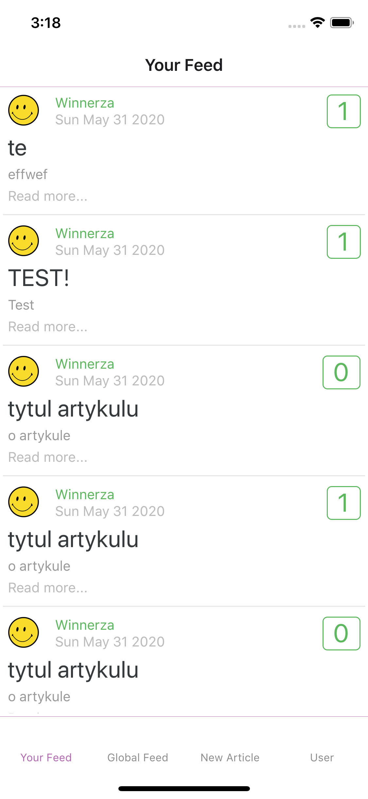
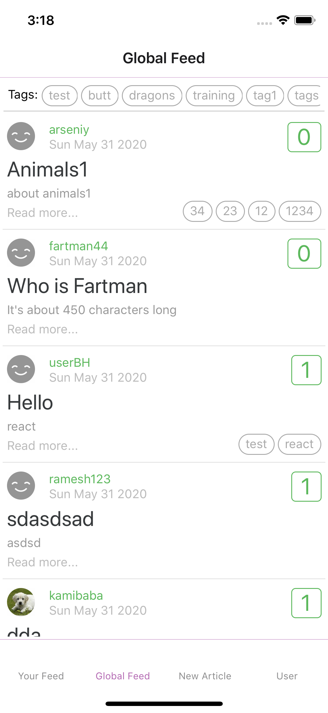
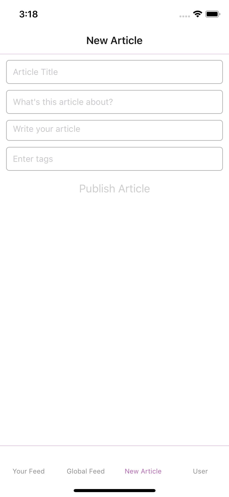
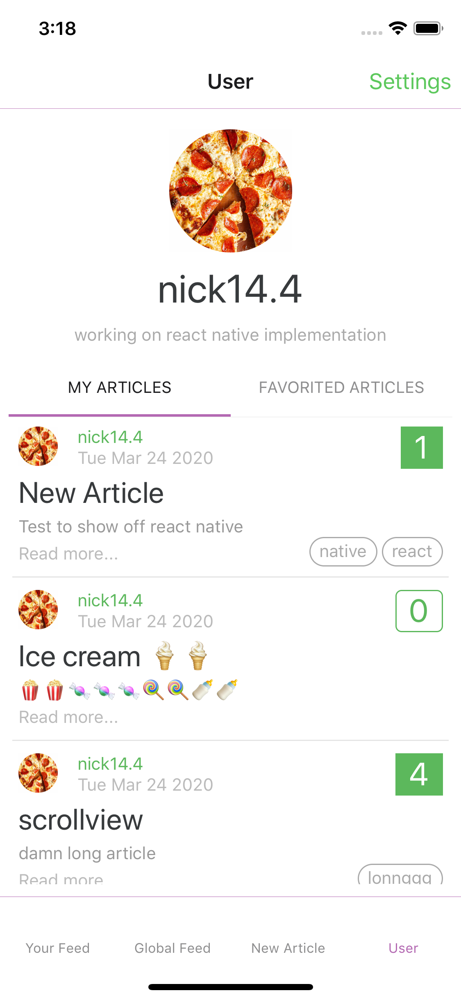
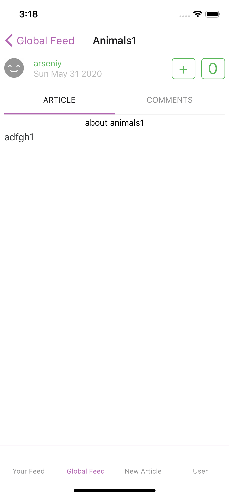
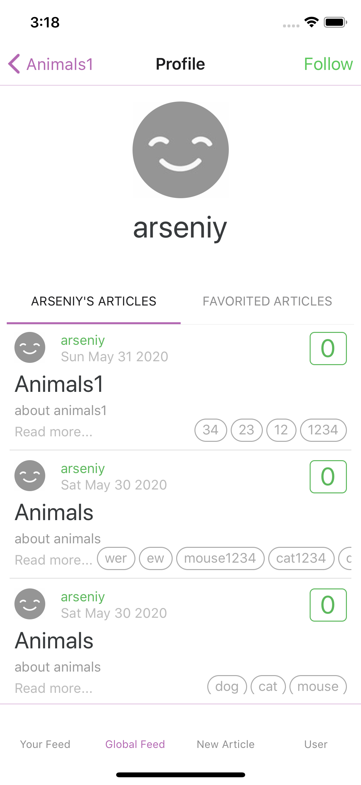
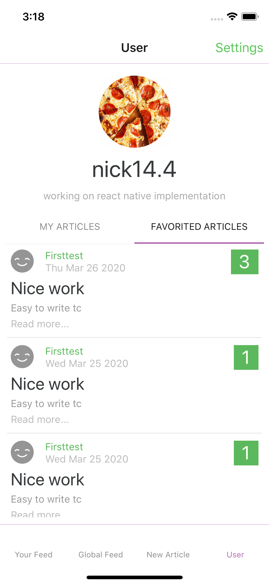

# 

> ### React Native codebase containing real world examples (CRUD, auth, advanced patterns, etc) that adheres to the [RealWorld](https://github.com/gothinkster/realworld-example-apps) spec and API.

### [RealWorld](https://github.com/gothinkster/realworld)

This codebase was created to demonstrate a fully fledged fullstack application built with **React Native** including CRUD operations, authentication, routing, pagination, and more.

We've gone to great lengths to adhere to the **React Native** community styleguides & best practices.

For more information on how to this works with other frontends/backends, head over to the [RealWorld](https://github.com/gothinkster/realworld) repo.

# How it works

> mobile application to interact with api

# Getting started

https://reactnative.dev/docs/getting-started

grab repo
- `git clone https://github.com/NWylynko/realworld-react-native`

install dependencies
- `yarn`
- ios
  - `cd ios; pod install; cd ..;`

start
- ios
  - `yarn ios`
- android
  - `yarn android`

## screenshots

<table>
<tr>
<td>

</td>
<td>

</td>
<td>

</td>
<td>

</td>
</tr>
<tr>
<td>

</td>
<td>

</td>
<td>

</td>
<td>

</td>
</tr>
</table>